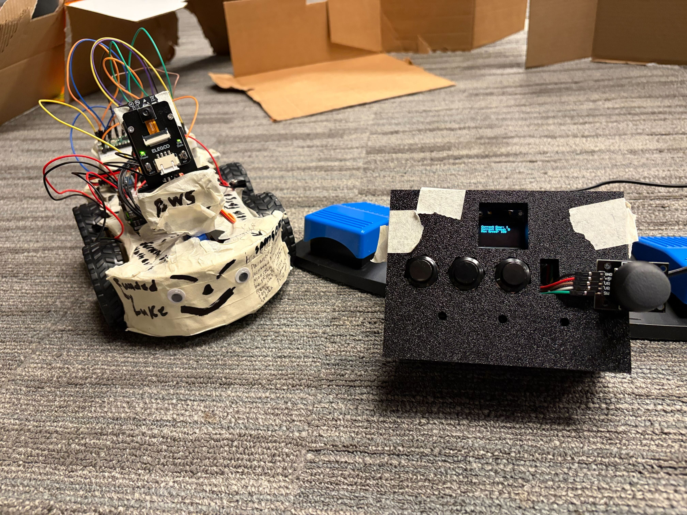
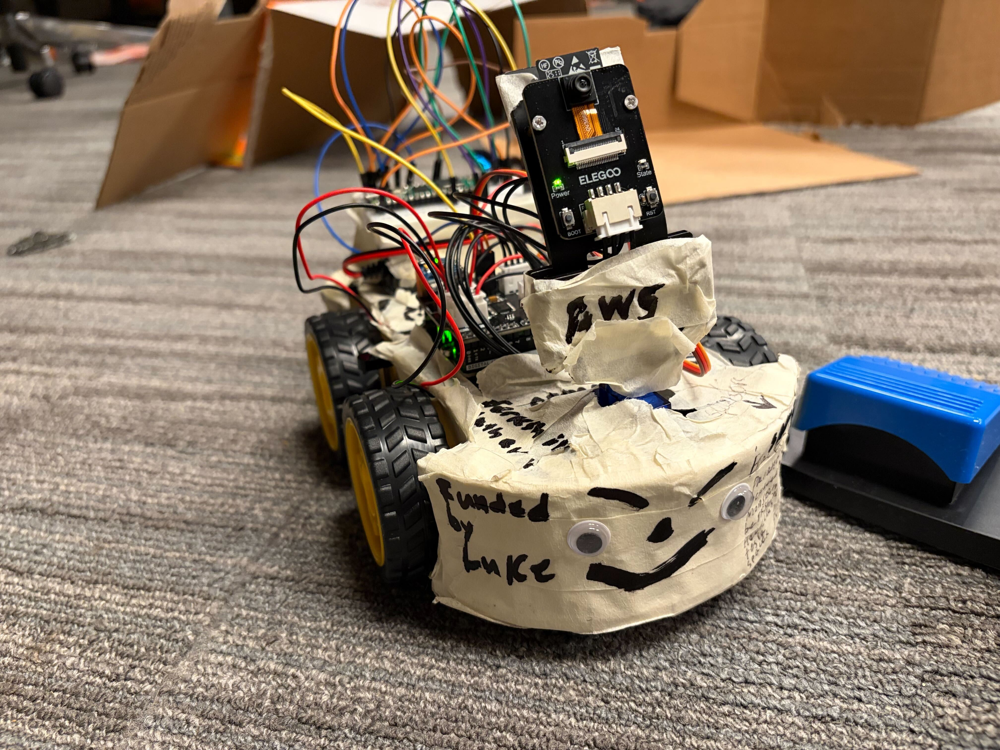
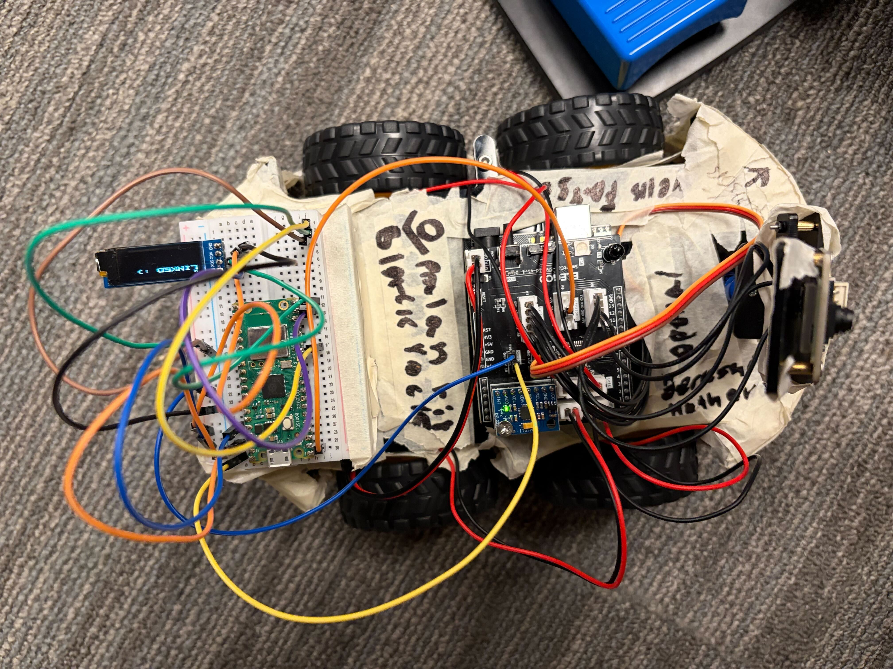
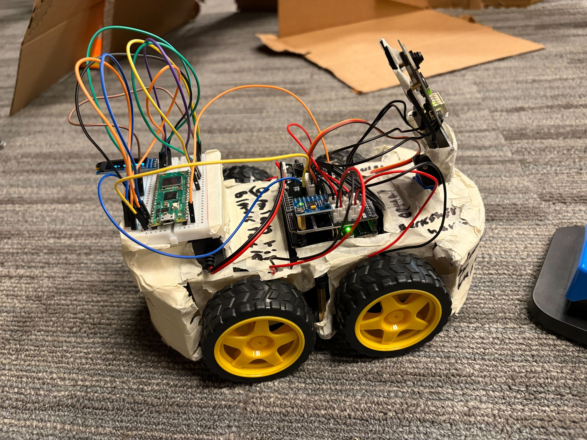
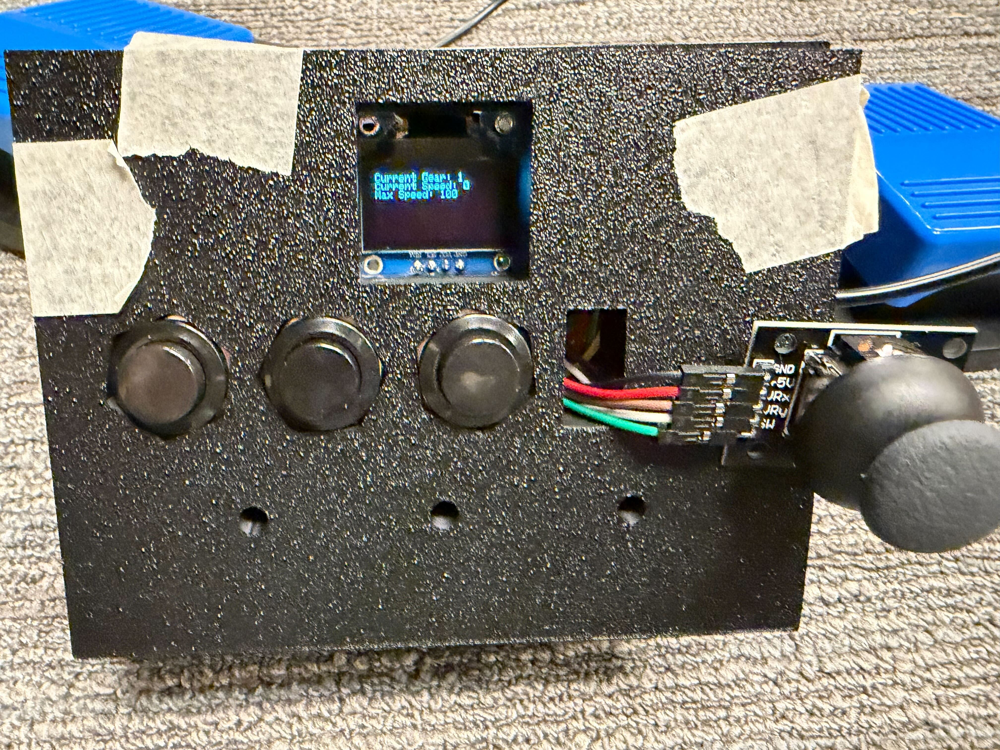
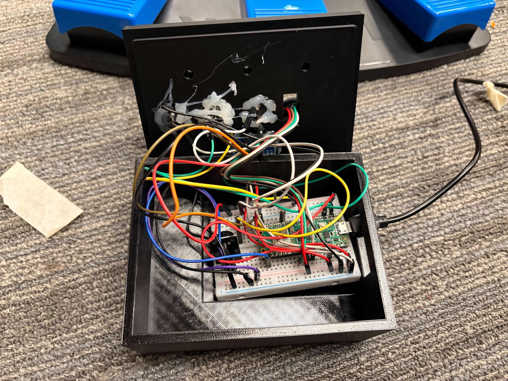
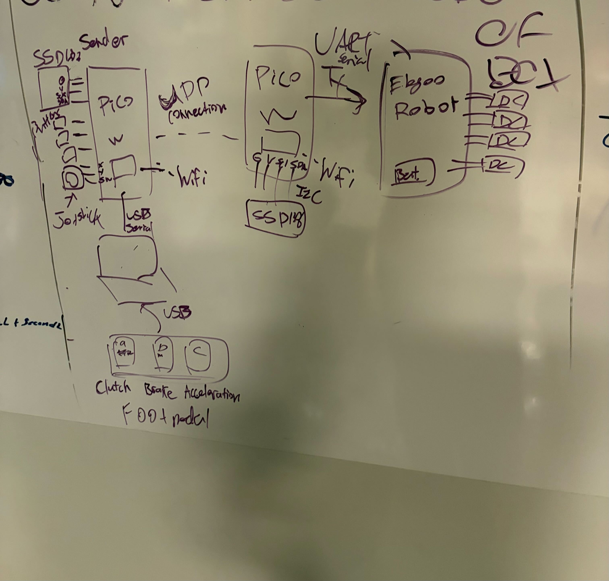

# Stasis: Clutch ClaudeBot9000
Suck at manual transmission? Well this project probably won't help you but this is an remotely controlled car whose movement is controlled through the use of a joystick, buttons, and foot pedals. Uniquely, we have implemented a manual transmission system with switching gears with buttons. It also a gas and break pedal for control and a screen that displays your speed and current gear (Also if you are currently stalled). We would also like to thank our sponsors written on the robot.

# Images

# Demo Video
[Link To Video!](https://www.youtube.com/shorts/IhivATOUFbg)

# Simplified Wiring Diagram
